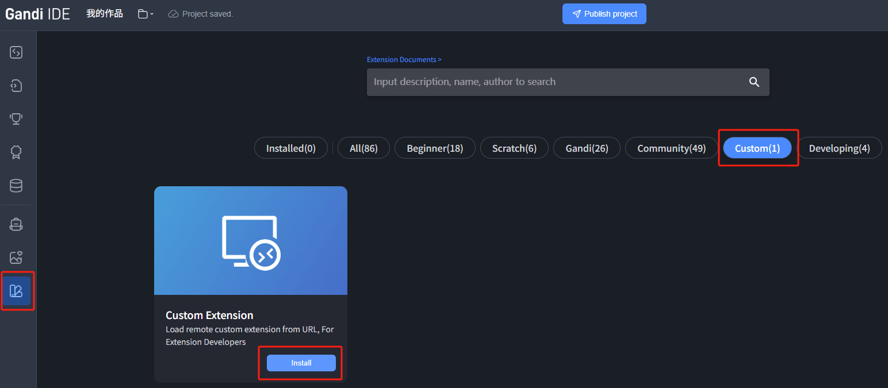
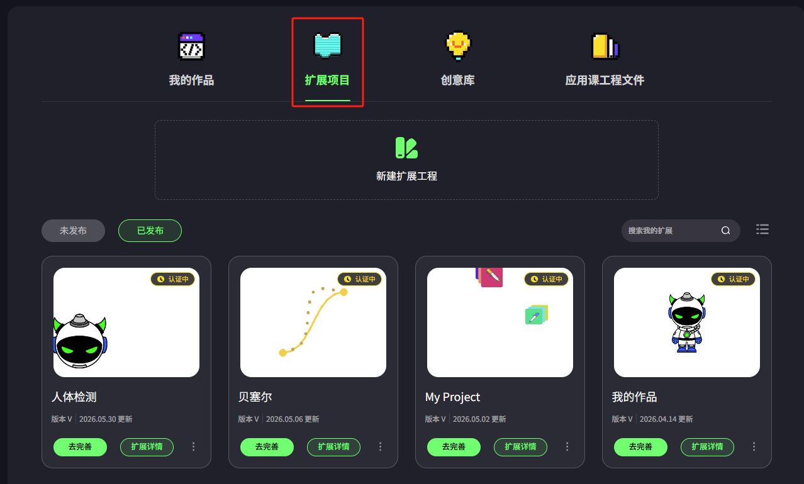
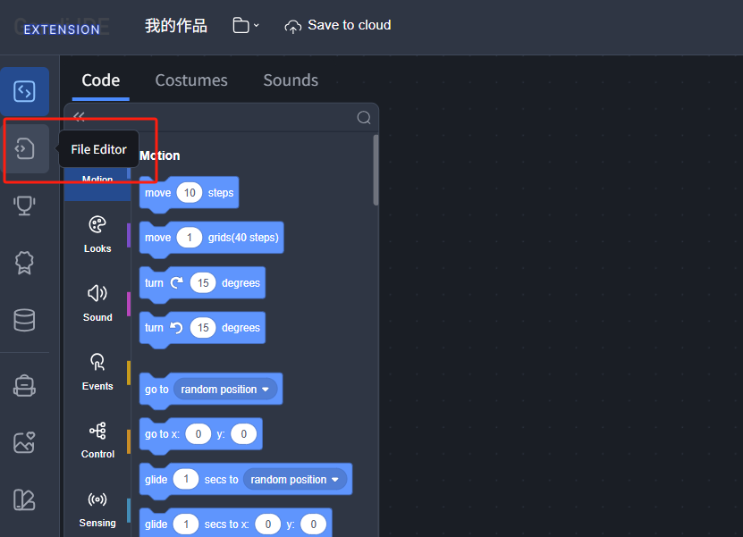
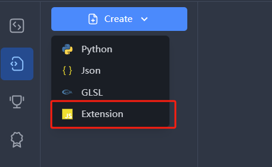
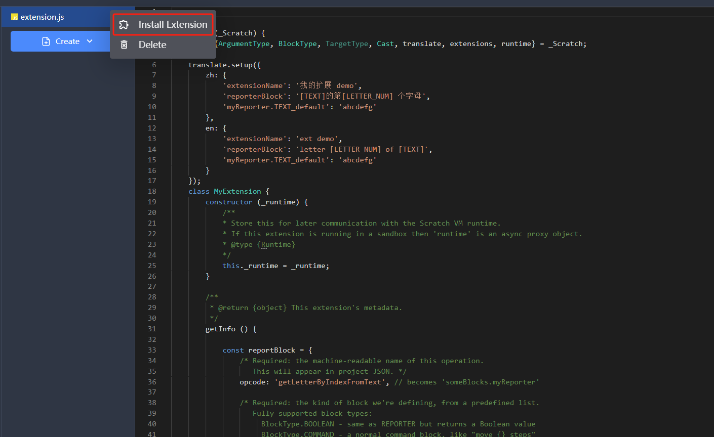

# ccw-user-extensions

- [ccw-user-extensions](#ccw-user-extensions)
  - [What for](#what-for)
  - [How to jump in](#how-to-jump-in)
    - [Load from extension url](#load-from-extension-url)
    - [Create extension project in CCW](#create-extension-project-in-ccw)
  - [Contribute to Gandi Extension Library](#contribute-to-gandi-extension-library)
  - [Example / Template](#example--template)
  - [Asset standard](#asset-standard)
  - [License](#license)

## What for

This repo is for Gandi Developer who wants make and test their own extensions.

## How to jump in

There are two ways to develop and test your extensions.

### Load from extension url

In the Gandi editor, switch to the Extensions tab on the left, click the “Custom” section, and load a custom extension via its URL.
> [!TIP]
> We recommend developing with [VSCode](https://code.visualstudio.com/) and installing the [Live Server extension](https://marketplace.visualstudio.com/items?itemName=ritwickdey.LiveServer) to serve local files as accessible URLs.

### Create extension project in CCW

> [!NOTE]
> Cocrea does not yet support this feature.

CCW users can create and test custom extensions directly from their project page — switch to the Extensions tab.   

Enter the extension editor, then click the file editor icon on the left.   

Create a new file and select Extension (.js) as the type.   

Edit your extension code, then right-click the file and select “Install extension”.   

## Contribute to Gandi Extension Library

Your can fork this repo and submit your PR. When your PR is merged, your extension will be available in Gandi Extension Library.

## Example / Template

- [example-ext.js](extensions/example/example-ext.js) — an annotated extension example
- Browse more examples in the [extensions directory](https://github.com/Gandi-IDE/custom-extension/tree/main/extensions)
- [Extension Tutorial](docs/en/lesson-1-understanding-extension-structure.md) — A step-by-step tutorial written by witcat
- Gandi extensions are largely compatible with TurboWarp's extension format, so you can also reference the [TurboWarp Extension Development docs](https://docs.turbowarp.org/development/extensions/introduction)

## Asset standard

Extension cover
type: png/jpg/svg
size: 600 × 372 px

Extension block icon
type: svg
size: 80 x 80 px

Extension menu icon
type: svg
size: 80 x 80 px

## License

Extensions in this repository are licensed under [LGPL-2.1](./LICENSE) by default, but certain extensions may have different licenses (such as extensions ported from TurboWarp for which we are grateful for their contributions).

